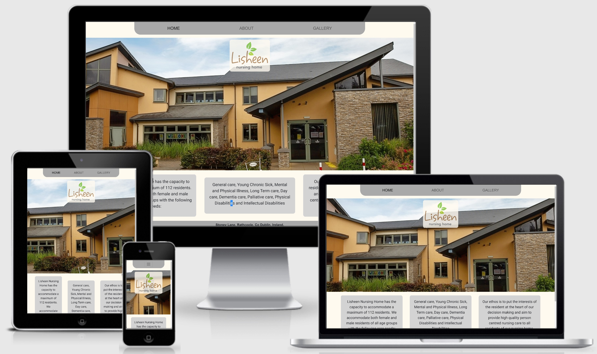
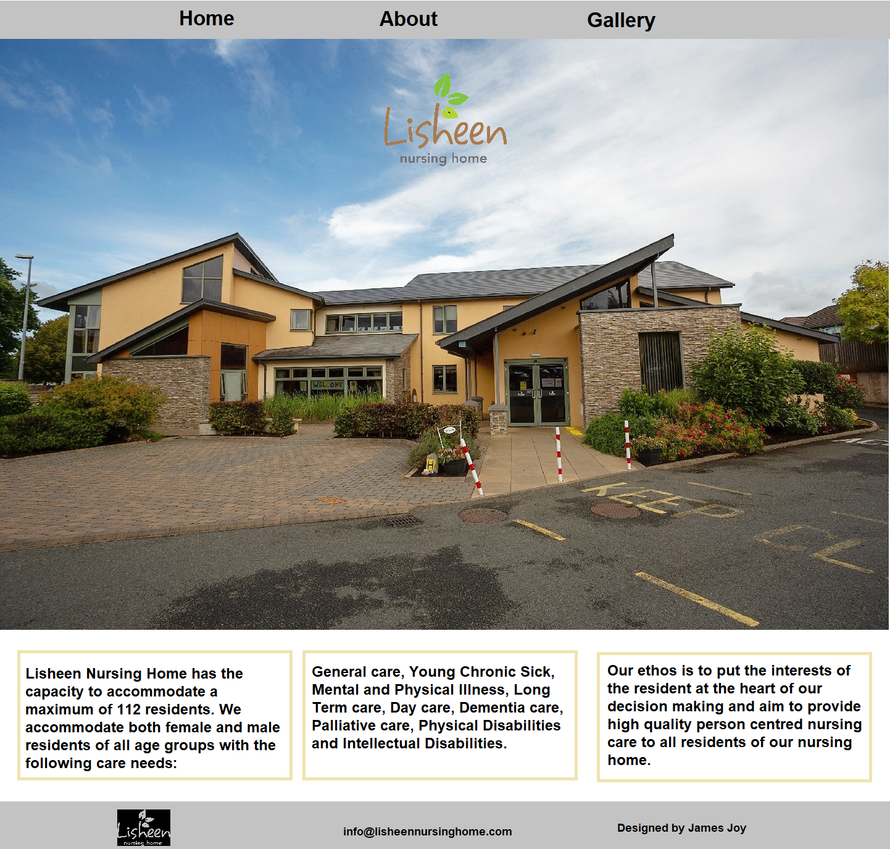
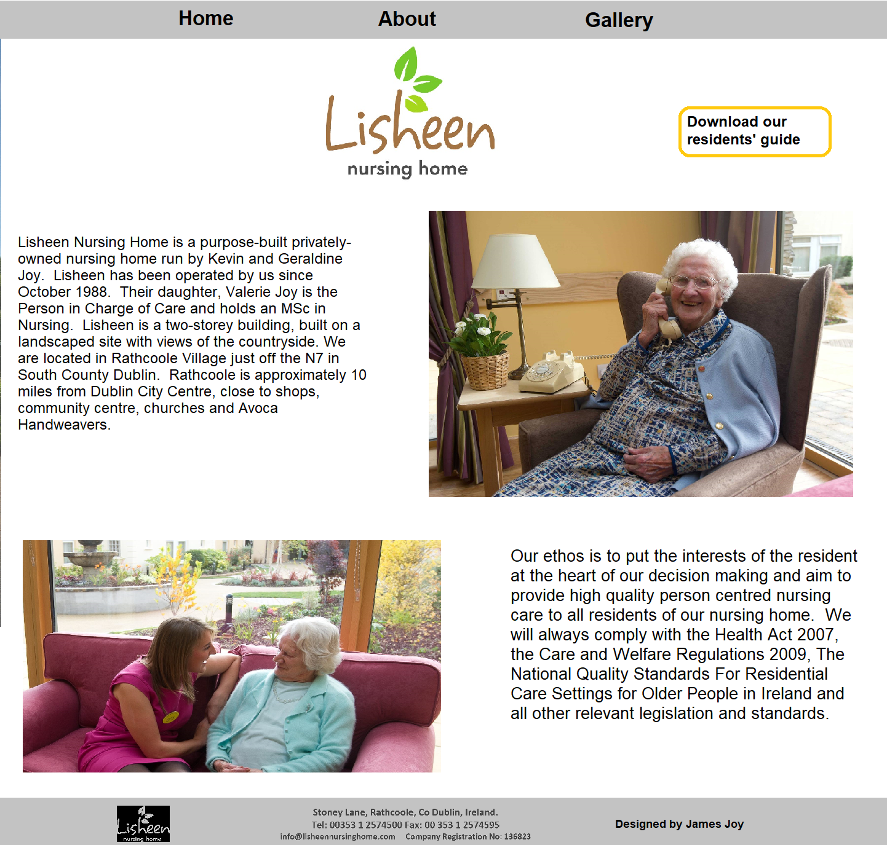
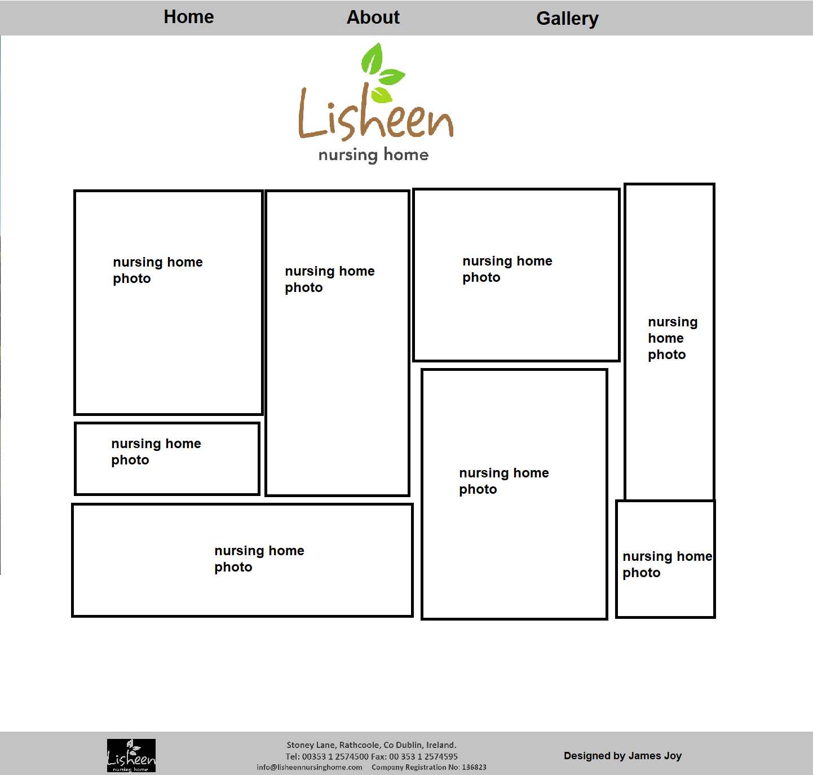

# Lisheen Nursing Home

## Code Institute: Milestone Project 1

*Lisheen Nursing Home* is a family-run nursing home in Rathcoole, Co. Dublin, Ireland. 

This was the first of four Milestone Projects that make up the Software Development (Full Stack) at *The Code Institute*. 
The main requirements were to make a responsive and static website with a minimum of three pages using HTML5 and CSS3.

[Click here to view the project live.](https://souptar.github.io/lisheen2/index.html)

## UX

### Main aims

- To serve potential future residents of the nursing home as a hub of information where they can learn about Lisheen.  

- To make *Lisheen Nursing Home* appear welcoming and appealing, by creating a design that was both streamlined and professional. 

- To give families of residents more information about *Lisheen Nursing Home*. 

- To create a design that would be fully responsive on all devices and screen sizes. 

### User Stories

1. I am a user who is looking for a long-term care facility for myself or a family member and would like to see information about prospective nursing homes.

2. I am a user who is a family member of a current resident of *Lisheen Nursing Home* and is looking for the address or contact inforamtion.

3. I am a user who uses mobile devices primarily to browse the web and would like a website that is presentable and easy to use on a phone.

4. I am a user who would like to see photos of a nursing home and it's facilities.

### Design Process

1. I began the design process by outlining the key features that I wanted my website to have. This led me to decide on the three pages I would have on my website: 'Home', 'About' and 'Gallery'.

2. The first major design decision was to keep the home page as clear and streamlined as possible, with a large hero image that would engage the user straight away. An image of the front of the nursing home I thought would be appropriate as it's a modern and appealing building.

3. I sketched out a quick wireframe for each page using MS Paint and referred back to that throughout the coding process for layout.

### Wireframing my project

## Features

### Existing Features

This project has three separate pages, each found by clicking on the corresponding name on the navigation bar. 

#### Consistent features across all pages

- A navigation bar with the logo just below it and a footer with contact information.

#### Home

- The logo fades in over the hero image.
- Brief description of Lisheen Nursing Home below the hero image.

#### About

- Two paragraphs of further information about the nursing home as well as two images of residents.
- A button where users can download the Residents Guide for more information.

#### Gallery

- A number of photographs of the nursing home in a masonry style layout.

## Technologies Used

- HTML5
    * The language used to create the form and add content to the website.
- CSS
    * The language used to style the HTML5 elements according to the design colour scheme.
- [Bootstrap framework](https://getbootstrap.com/) 
    * I decided to use Bootstrap's grid container system as I wanted to design my project with a 'mobile first' approach.
- [iLoveIMG](https://www.iloveimg.com/) 
    * I used iLoveIMG to compress my image files to try to reduce the loading time for each page. 
- [Google Fonts](https://fonts.google.com/)
    * I used Google Font for the roboto font.
- [Favicon & App Icon Generator](https://www.favicon-generator.org/)
    * I used this to make a simple favicon from a portion of the logo

## Testing

### Testing User Stories

Based on the User Stories listed above:

1. This user will find information about Lisheen from the About page and also from the Residents Guide available for download on that page.

2. The user will find contact details for the nursing home and it's address in the footer of each page.

3. The website is responsive and so is easy to navigate and use on mobile devices

4. This user will find photographs of the nursing home in the Gallery page.

### Validating the HTML and CSS code

My code documents passed the following tests:
- HTML: [W3C Markup Validation Service](https://validator.w3.org/)
- CSS: [W3C Markup Validation Service](https://jigsaw.w3.org/css-validator/)

### Testing different browsers

I manually tested the website on the following web browsers, checking that buttons, responsiveness and design worked as planned:
- Google Chrome 
- Mozilla Firefox 
- Brave
- Opera

### Testing responsiveness

I manually tested the live project by doing the following:

- Using Google Developer Tools to view the project on devices with different screen sizes.
- Asking for feedback from friends and family who opened and interacted with the project on their devices.

## Deployment

### Deploying my project 

I created my project on GitHub and used GitPod's development environment to write my code. 

To make my project viewable to others, I deployed my project to GitHub Pages with the following process:

1. I opened the 'Settings' section of my project repository in GitHub.
2. From there, I scrolled to the 'GitHub Pages' section.
3. Here I selected 'master branch' as my Source.
3. This deployed my project on GitHub Pages and allowed me to share the live website with others. 

Use the following link to view my live project: [Lisheen Nursing Home](https://souptar.github.io/lisheen2/index.html)

More information about this process can be found on the following link: [Configuring a publishing source for your GitHub Pages site](https://help.github.com/en/github/working-with-github-pages/configuring-a-publishing-source-for-your-github-pages-site)

### Cloning my project

If you would like to work on my project further you can clone it to your local machine using the following steps:

1. Scroll to the top of my repository and click on the "clone or download button"
2. Decide whether you want to clone the project using HTTPS or an SSH key and do the following:
    * HTTPS: click on the checklist icon to the right of the URL
    * SSH key: first click on 'Use SSH' then click on the same icon as above
3. Open the 'Terminal'
4. Change the current working directory to the location where you want the cloned directory
5. Type 'git clone', and then paste the URL you copied earlier.
6. Press 'Enter' to create your local clone.
    
You can find both the source of this information and learn more about the process on the following link: [Cloning a Repository](https://help.github.com/en/github/creating-cloning-and-archiving-repositories/cloning-a-repository)

## Credits

### Content

The content of this website is almost entirely from Lisheen Nursing Home itself where I got the text for the text elements on the site as well as the images.

### Media

The images were all sent to me by Lisheen Nursing Home.

### Acknowledgements

Thank you to the following people who helped with support, inspiration and guidance at different stages in the project:

- My mentor Seun Owonikoko
- *Code Institute* tutor Roman
- My friends for their patience and honest critique throughout
